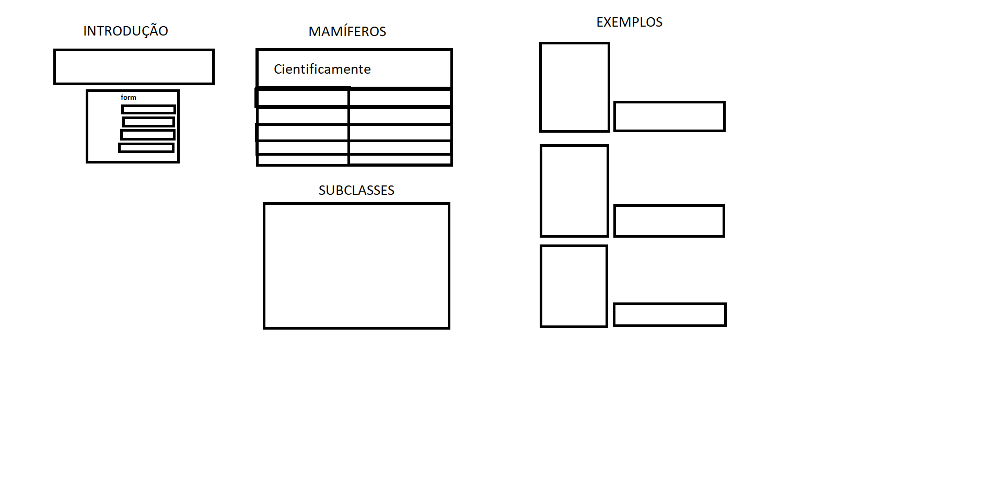
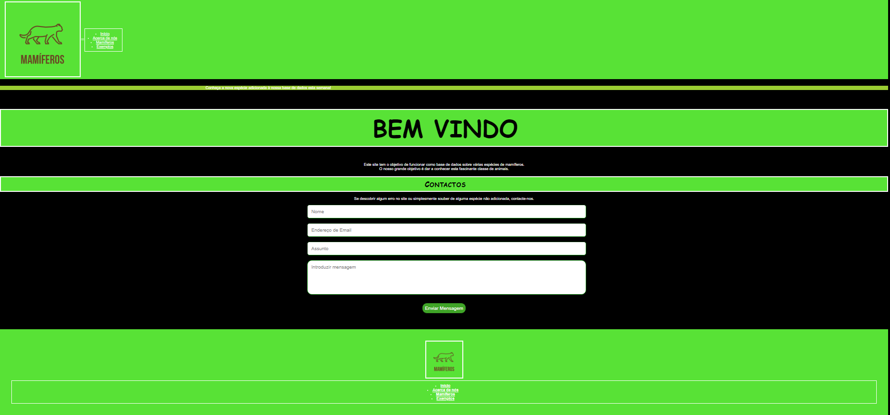
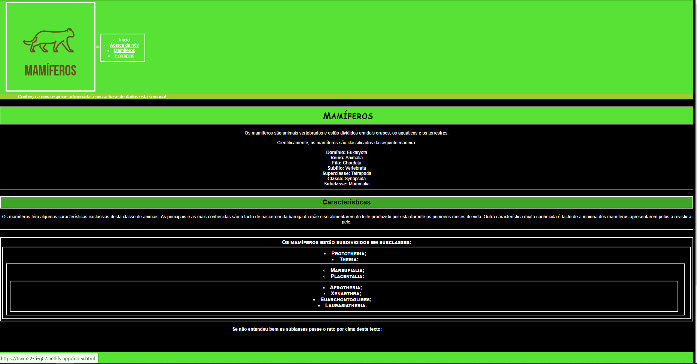
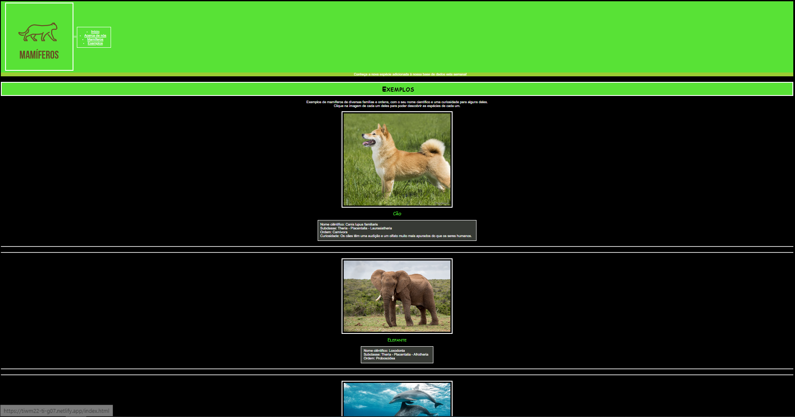
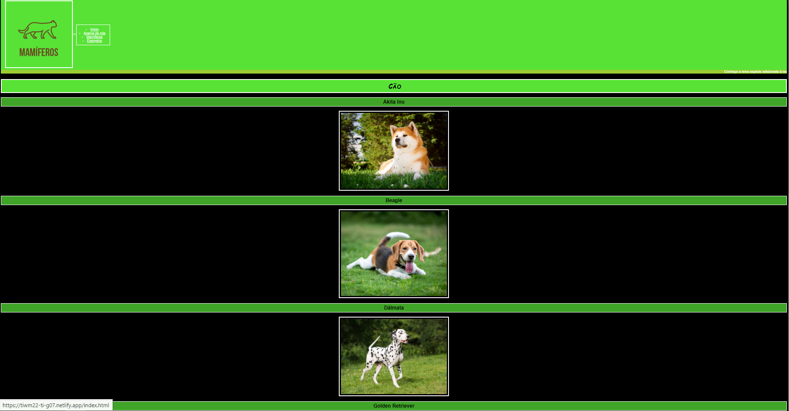
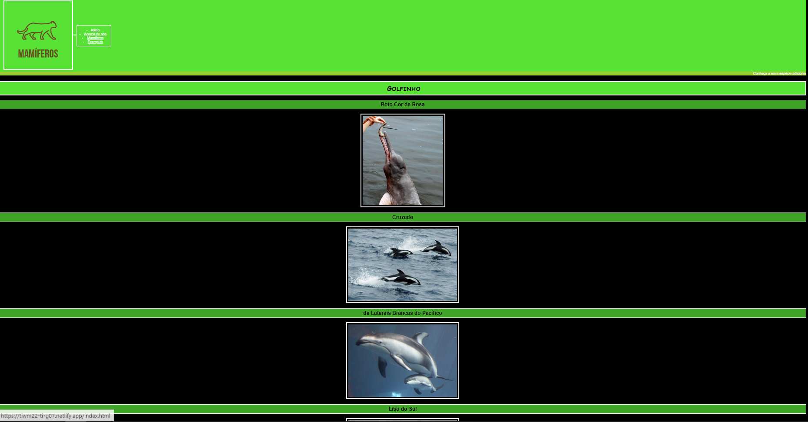
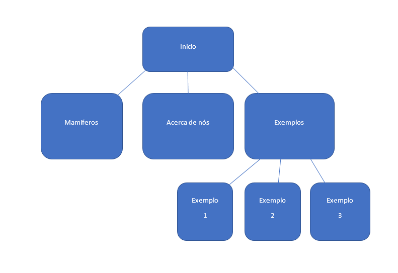

# Interface com o utilizador

O nosso trabalho apresenta quatro páginas de HTML, três de CSS, um de XML e um de Javascript. Apresenta várias imagens, listas, um menu, um tabela e um formulário. 
Neste trabalho nós apresentamos os mamíferos, para os quais mostramos algumas características, as subclasses e alguns exemplos. 
As ferramentas que utilizamos foram o Visual Studio Code, o GitHub, o Netlify, o Paint e o Word.

### Sketchs

| | |
:---: | :---:

Este era mais ao menos o esquema que nós planeamos fazer no nosso trabalho. Ficou com algumas diferenças, mas no fundo teve uma estrutura semelhante.

| | |
:---: | :---:

Esta é a nossa primeira página de HTML, onde vemos o formulário.

| | |
:---: | :---:

Esta é a nossa segunda página de HTML, onde falamos um pouco sobre nós e disponibilizamos os documentos.

| | |
:---: | :---:

Esta é a nossa terceira página de HTML, onde falamos um pouco sobre os mamíferos em geral.

| | |
:---: | :---:

Esta é a nossa quarta página de HTML, onde mostramos vários exemplos de mamíferos com algumas informações.

| | |
:---: | :---:
 | 

Estas duas imagens são exemplos do que aparece quando carregamos em cada um dos animais.

### SideMap

| | |
:---: | :---:

Aqui temos um sitemap para ajudar a perceber o website.

---
[< Previous](Relatório1.md) | [^ Main](../../../) | [Next >](Relatório3.md)
:--- | :---: | ---: 